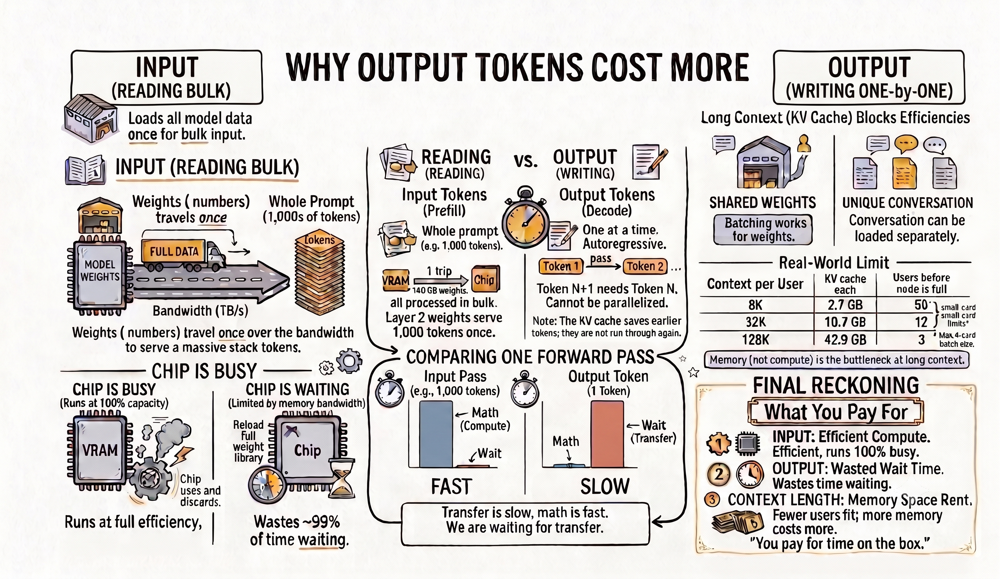

[](input-vs-output-cost.png)

Every AI provider charges your AI usage by input and output tokens. What you can see is that output tokens are more expensive — by 5× and more. If you're a curious one and you often ask yourself how and why, this blog might be the one for you.

The usual explanation you will find is that generating text is more computational work than reading it. My understanding is a bit different. I had to dig all the way down to the hardware — what the chip actually does, where the weights sit, and how long they take to get from one to the other. That's the trip, so you know what you're signing up for.

---

## What "computation" actually means

To understand computation we need to understand **FLOP**. It stands for *FLoating-point OPeration*, and it means one arithmetic act on a decimal number: one multiply, or one add. `3.7 × 0.02` is one FLOP. `1.4 + 0.9` is one FLOP. That's the whole definition.

The units stack in thousands — KFLOP (thousand), MFLOP (million), GFLOP (billion), **TFLOP** (trillion), PFLOP (quadrillion). And one distinction is worth noting:

- **FLOPs** (lowercase s) is an *amount of work*. Like **miles**.
- **FLOPS** (capital S) is *work per second*. Like **miles per hour**.

An NVIDIA H100 is rated at **989 TFLOPS** — 989 trillion operations every second. That's the chip we'll be using throughout.

### The arithmetic in an LLM is: multiply, then add.

To understand what arithmetic an LLM is doing, let's understand tokens. A token is a point in a space with thousands of directions — and a point is just its coordinates, one number per direction.

Imagine it like this. The model has a **vocabulary**: every word fragment it can read or write, each one an entry with a fixed number. Llama 3 70B — the model this whole post uses — has **128,256** of them. And it has an **embedding dimension**: how many directions that space has, which for this model is **8,192**. So "bank" is one entry in the vocabulary, and what the model looks up under that entry is a list of 8,192 numbers.

That's the whole representation. A token is a list of 8,192 numbers and nothing else, with points close together meaning similar things.

And that lookup is fixed. There is one entry for "bank," holding one list, so every "bank" the model ever reads starts from the same 8,192 numbers — which can't be right, because the right numbers depend on the neighbours. Take "river bank" and "bank loan" — "bank" arrives with the identical list in both, and the model has to pull it toward the *water* region of the space in one and the *money* region in the other. You did that just now without noticing; you never even considered the money sense of the first one. The model has no such instinct. All it has is arithmetic, so it **adjusts each token's numbers using the other tokens' numbers**, and the only way to do that is multiply and add.

That step is called **attention**: each token compares itself against every other token, then takes most from the ones that matter to it.

So every layer, every attention head, every bit of what looks like understanding is one operation, run many many times:

> take a number, multiply it by a weight, add it to a running total

That's a **multiply-accumulate**: 2 FLOPs, one multiply and one add.

A weight is just a number — the part that was *learned*. Training worked through an enormous amount of text, settled on values that make these multiply-adds come out useful, then froze them. The same weights run for every token, every request, every user. That's what the "70B" counts: 70 billion weights.

To see the shape of it, shrink a token's list to three numbers. Inputs `a b c`, outputs `x y z`:

```
x = a·w1 + b·w2 + c·w3
y = a·w4 + b·w5 + c·w6
z = a·w7 + b·w8 + c·w9
```

Each output gets its own row of weights, and each weight is used exactly once — once in a multiply, once in an add. **9 weights → 18 FLOPs.** Three numbers in, three out — so the next layer does the same thing again with nine fresh weights. Real models do this with the 8,192-number lists from above, which means more weights and more arithmetic, but the ratio between them never moves:

> **Every weight in the model participates in exactly one multiply and one add, per token.**
> **So: 2 FLOPs per weight, per token.**

That covers every weight — but not quite every multiply-add. Attention also compares tokens against each other, multiplying token numbers by other token numbers, with no weight involved. Those sit outside the 2-FLOPs-per-weight count, and we'll come back to them once the prompt gets long enough for them to matter.

---

## Why that matters for the cost

A multiply-add can only happen if the weights are sitting right where the multiplying happens. And on a GPU, those are two separate pieces of hardware.

There is the <span class="accent-teal">chip</span>, which does all the arithmetic — for a 70B model, 70 billion multiply-adds per token, **140 GFLOP**, all of it inside the chip and nowhere else. And there is the <span class="accent-orange">memory</span>, the GPU's VRAM, where the weights are kept. Memory doesn't compute anything; it only holds numbers. So every weight has to be carried from VRAM over to the chip before it can be multiplied by anything.

### How big is a model, in bytes?

A weight is a number, and a number takes up space. How much depends on the **precision** you store it at. The serving standard is **BF16**: 16 bits, so 2 bytes per weight. Which turns a parameter count into a file size:

```
70,000,000,000 weights × 2 bytes = 140,000,000,000 bytes = 140 GB
```

That's where the 140 GB comes from. The chip does have a little memory of its own — SRAM, much faster but there is very little of it: tens of megabytes, against that model's 140,000 megabytes of weights. So a chip can never hold enough to keep a model resident. The weights live in VRAM, and they have to make the trip.

That trip has a speed limit, and it has a name — <span class="accent-orange">memory bandwidth</span>. For an H100 it's **3.35 TB/s**.

140 GB also doesn't fit on one card; an H100 holds 80 GB. Two would hold it, but that leaves almost nothing spare, and you'll see at the end why that isn't enough. So in practice you spread it wider — say four cards, each holding 35 GB, every layer cut four ways, each card doing a quarter of the multiply-adds.

And 35 GB still doesn't fit on a chip. So the weights never leave VRAM. The card sends the chip a small block at a time, the chip uses it and throws it away to make room for the next one:

```
GPU VRAM   [ 35 GB — never leaves ]
     │
     │   copy one small block (a few MB)
     ▼
GPU chip   [ multiply-add, then discard ]
     │
     └──►  next block … until all 35 GB has passed the chip
```

That is the trip every weight has to make. Now let's see how many times it has to happen when the model reads your input, and when it writes its response.

---

## Reading happens all at once. Writing happens one token at a time.

When you send your input to the LLM there are two phases:

**Prefill** is the reading phase. The model takes your whole input and runs it through itself once, start to finish — that single trip through every layer is called a **forward pass**.
**Decode** is the writing phase. The model produces the response, one forward pass per token.

The difference between them comes down to one question. Before the model can do any arithmetic on a token, that token's numbers have to exist:

> *For the tokens I'm about to work on, do their numbers already exist — or do I have to produce them first?*

During prefill, they exist. Your whole prompt exists before the model starts — the first token and the nine-hundredth are equally available, and nothing in it is waiting on a guess the model hasn't made yet. So every token can be worked on at the same time: the model runs layer 1 for all thousand tokens, then layer 2 for all thousand, and so on down the stack. A thousand tokens of input is one forward pass. (Input tokens do depend on each other — that's attention, token 900 has to look at all 899 before it. But you typed those; they're already there.)

Output is where that breaks. To write token 5 the model must know token 4 — and token 4 doesn't exist until it has been produced. It has to be made first, then fed back in. There's no way to do the two at once, because one of them is an *input* to the other.

```
prompt (1,000 tokens) ──► one pass ──► token 1
token 1 ───────────────► one pass ──► token 2
token 2 ───────────────► one pass ──► token 3
                          …one pass per token, each pass one token wide
```

Note what does *not* happen: the prompt isn't run through the model again. Each pass carries only the newest token, because everything earlier was saved the first time it was computed — that's the KV cache, and we'll come back to it.

That's what "autoregressive" means: a thousand output tokens, a thousand forward passes, in strict order. Same model, same arithmetic per token — one phase gets to do it in bulk, the other isn't allowed to.

---

## What one forward pass actually costs

**One output token.** A forward pass walks through the model's layers in order, and a 70B model has 80 of them. At each layer, that layer's weights are pulled from VRAM to the chip, used, and then overwritten by the next layer's — there's nowhere to keep them. So producing a single token means:

1. **Pulling all 140 GB of weights out of memory** — **41.8 ms**
2. **Doing 140 GFLOP of arithmetic with them** — at 989 TFLOPS, **0.14 ms**

The chip can't multiply a weight that hasn't arrived yet, so <span class="accent-orange">memory bandwidth</span> sets the pace: the token takes about **42 ms**, and only 0.14 ms of that is arithmetic. The chip spends **99.7%** of the token waiting for bytes.

> **A note on these numbers.** They're *one* H100's specs, so they describe one card doing all the work. On the four-card split each card reads only its own 35 GB, all four at once, and a real decode step is closer to 10 ms. I'll keep the single-card figures throughout: every ratio below is unchanged, and the ratios are the entire argument.

Then it starts over for the next token, and it can't reuse a thing. Token 2 begins at layer 1, whose weights left the chip 79 layers ago. The copy in VRAM is still sitting there, untouched — it just has to make the trip again.

**One thousand input tokens.** Same model, same weights, same memory. But prefill has all 1,000 tokens in hand, so they travel through the layers together:

1. **Pulling all 140 GB of weights out of memory** — **42 ms** *(once, not 1,000 times)*
2. **Doing 140 TFLOP of arithmetic with them** — **141 ms**

Nothing was skipped. That 141 ms is a thousand tokens' worth of multiply-adds — a thousand times the arithmetic of a single output token, taking a thousand times as long. What changed is step 1: layer 1's weights arrive once and serve all 1,000 tokens before they're discarded. **A thousand output tokens means a thousand trips through 140 GB. A thousand input tokens means one.**

Which is the whole comparison. <span class="accent-orange">Loading</span> and <span class="accent-teal">math</span> happen at the same time, so you wait for whichever is slower:

```
Input, 1,000 tokens
  math     ████████████████████ 141 ms   ← what you wait for
  loading  ██████ 42 ms

Output, 1,000 tokens
  math     ████████████████████ 141 ms
  loading  ██████████████████████████…   41,791 ms   ← what you wait for
```

The <span class="accent-teal">math</span> bar is the same length in both — same model, same chip, same arithmetic per token. Only the <span class="accent-orange">loading</span> bar moved, because output drags 140 TB past the chip where input drags 140 GB. So output's total goes from 141 milliseconds to nearly 42 seconds, with the chip using **0.3%** of its arithmetic capacity the entire time.

The <span class="accent-teal">compute</span> is the same on both sides. The <span class="accent-orange">waiting</span> is what differs.

---

## Input isn't linear

That 141 ms was measured *at a thousand tokens*. Change the prompt length and it doesn't move in proportion, because a forward pass contains two kinds of multiply-add and only one has appeared so far.

**Token × weight.** Every token gets multiplied by every weight, so every token costs the same: twice the prompt, twice the work. This is the arithmetic the 141 ms measured.

**Token × token.** Attention compares each token against the ones before it, no weights involved. Here the tokens *don't* cost the same. Token 10 has 9 tokens to compare itself against; token 100,000 has 99,999. Late tokens cost far more than early ones, and the longer your prompt, the more late tokens it has.

So input cost isn't one number, it's two: the weight part grows with your prompt, the attention part grows with its *square*. At a thousand tokens the second is a rounding error, which is why every figure above could ignore it. At a hundred thousand it's roughly as expensive as all the weight math combined — past that point, twice the prompt is more than twice the cost.

---

## Nobody is served at batch one

Everything above assumes the GPU is generating for exactly one person. No provider runs that way, and serving many at once changes what the weight reloading costs.

Remember what made decode so expensive: 41.8 ms hauling weights, 0.14 ms using them — for 99.7% of every token, the chip has nothing to do. That idle time is what makes serving many users at once nearly free: the weights are being read anyway, so the same trip through memory can feed more than one request.

**Batching** does exactly that. Gather more users who all need the next token of their own response — say 295 of them — load layer 1's weights *once*, and use them for all 295 before letting them go. 295 is the **batch size**, and the number comes from the hardware: the read takes 41.8 ms, one user's math takes 0.14 ms, so that many users fit inside the time the read was going to take anyway. It's the point where the chip is finally busy, and the last user who rides along for free.

| Users in the batch | Reading the weights | Doing the math | Step takes | Tokens out |
|---:|---:|---:|---:|---:|
| 1 | 41.8 ms | 0.14 ms | 41.8 ms | 1 |
| 64 | 41.8 ms | 9.1 ms | 41.8 ms | 64 |
| 295 | 41.8 ms | 41.7 ms | 41.8 ms | 295 |

It's the same 140 GB read every time — that's why the first column never moves, and why the step takes 41.8 ms whether it serves one person or 295. Only the math column grows, filling time the chip was already spending on the read.

Which leaves the obvious question: if 295 people can split one read, why is output still the expensive side?

---

## The KV cache is what batching can't fix

To write its next token, a sequence needs attention over everything before it — every key and value for every prior token. Calculating those again each time would mean redoing the entire prompt over and over, so they're saved instead. That's the **KV cache**, and every decode step re-reads all of it.

> The weights are **shared**. The KV cache is **not**.

The weights were frozen when training ended, and everyone in the batch is running those same numbers — one fetch serves every user at once. But your KV cache is *your conversation*. Nobody else can use it. It must be read for you, separately, every step.

And it has to *sit somewhere* — the same VRAM holding the weights. Those four H100s have 320 GB between them; take out the 140 GB model and the ~45 GB the server needs for its own scratch space, and there's roughly **135 GB** left to hand out. The cache grows with every token of context, so the longer the conversations, the fewer of them fit:

| Context per user | KV cache each | Users before the node is full |
|---|---:|---:|
| 8K | 2.7 GB | 50 |
| 32K | 10.7 GB | 12 |
| 128K | 42.9 GB | 3 |

The math had room for 295 people. Memory runs out at 50 — or at three. **<span class="accent-orange">Memory</span> is what you run out of, never the <span class="accent-teal">chip</span>.**

And that's the answer to the question. Take the 8K row: 50 users in the batch, so a decode step still reads all 140 GB in 41.8 ms but only does 7 ms of math. The chip sits at **17%** — while prefill, with all 1,000 tokens in hand, runs it at 100%. Same box, same cost per second:

```
Output, batch 50 :    50 tokens per 41.8 ms  ≈  1,200 tokens/second
Input,  prefill  : 1,000 tokens per 141 ms   ≈  7,000 tokens/second
```

Batching was supposed to close that gap, and it would have — the cache runs out of room and bandwidth first. And it compounds: longer contexts mean fewer users in the batch, and fewer users mean a costlier output token.

---

## Conclusion

Per token, input and output are the same amount of compute. The asymmetry is <span class="accent-orange">memory</span>, not <span class="accent-teal">math</span>: to generate one token alone, you read every weight in the model. Serve hundreds of requests at once and that read is shared — cost per token collapses, all the way down to prefill's throughput. The KV cache doesn't collapse. Each sequence carries its own, nothing is shared, and it grows with every token of context until memory, not arithmetic, is what you've run out of.

So what you're actually paying for is time on the box, and three different things decide how much:

**Input is billed as <span class="accent-teal">compute</span>, output is billed as <span class="accent-orange">bandwidth</span>, and context length is billed as rent on the box.**

---

## Sources

**Hardware**
- [NVIDIA H100 product page](https://www.nvidia.com/en-us/data-center/h100/) — 989.5 TFLOPS dense BF16; 3.35 TB/s HBM3; 80 GB
- [NVIDIA — KV cache offload with CPU–GPU memory sharing](https://developer.nvidia.com/blog/accelerate-large-scale-llm-inference-and-kv-cache-offload-with-cpu-gpu-memory-sharing/) — ~140 GB of weights for Llama 3 70B at FP16; ~40 GB of KV cache at a 128K context, batch of one, "scales linearly with the number of users"

**Model mechanics**
- [Llama 3 70B `config.json`](https://huggingface.co/meta-llama/Meta-Llama-3-70B/blob/main/config.json) — `vocab_size` 128,256 and `hidden_size` 8,192, the two numbers in the opening section
- [Transformer Explainer](https://poloclub.github.io/transformer-explainer/) (Georgia Tech) — interactive visualization of GPT-2 Small, if you want to watch the multiply-adds happen; [paper: arXiv:2408.04619](https://arxiv.org/abs/2408.04619)
- [Attention Is All You Need](https://arxiv.org/abs/1706.03762) — §3.2.3 on preserving "the auto-regressive property," which is what forces decode to run one token at a time and lets prefill run all at once

**Cost structure at long context**
- [Meta Engineering — Scaling LLM inference](https://engineering.fb.com/2025/10/17/ai-research/scaling-llm-inference-innovations-tensor-parallelism-context-parallelism-expert-parallelism/) — Llama 3 405B: 128K-token prefill in 3.8 s, 1M-token prefill in 77 s — 8× the tokens, 20× the time, which is the quadratic term showing up in a measurement

**Pricing**
- [Anthropic pricing documentation](https://platform.claude.com/docs/en/pricing) — the input/output rates behind the 5× in the opening
